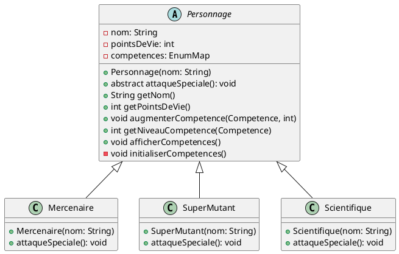

### **Étape 5 : Implémentation de classes de personnages spécialisées**

Dans cette étape, vous allez implémenter des classes de personnages spécialisées inspirées de l'univers de Fallout 3. Vous utiliserez l'héritage pour créer ces classes et surchargerez la méthode `attaqueSpeciale()` pour chaque type de personnage.

#### Instructions :

1. Utilisez le diagramme de classes suivant comme guide pour créer les classes de personnages spécialisées : 



1. Transformez votre classe `Personnage` en une classe abstraite avec les attributs et les méthodes communs à tous les personnages.
2. Ajouter une méthode `public abstract void attaqueSpeciale();`
3. Créez des classes spécialisées `Mercenaire`, `SuperMutant` et `Scientifique` en héritant de la classe `Personnage`.
4. Surchargez la méthode `attaqueSpeciale()` dans chaque classe spécialisée pour définir le comportement de l'attaque spéciale de chaque type de personnage.
5. Testez vos classes en créant des instances de chaque type de personnage et en appelant la méthode `attaqueSpeciale()`.
6. Dans le constructeur, appelez la méthode `super()` pour appeler le constructeur parent qui est censé initialiser les compétences à 0
Après l'initialisation, dans la classe enfant, ajouter par exemple `augmenterCompetence(Competence.AGILITE, 5);` ainsi chaque classe de personnage à un avantage par rapport aux autres.

### Conseils :

- Pour créer une classe avec héritage, utilisez le mot-clé `extends` suivi du nom de la classe parente.
- Pour surcharger une méthode, déclarez une méthode avec la même signature dans la classe enfant, mais avec une implémentation différente.

```java
// Classe Mercenaire
class Mercenaire extends Personnage {
    // Constructeur
    public Mercenaire(String nom) {
        super(nom);
        augmenterCompetence(Competence.AGILITE, 5);
        // Mettez la compétence de votre choix pour illuster
    }

    // Attaque spéciale du mercenaire
    @Override
    public void attaqueSpeciale() {
        System.out.println(getNom() + " utilise son attaque spéciale : Tir de précision !");
    }
}
```

### **Étape 6 : Utilisation du polymorphisme**

Dans l'étape 6, nous allons montrer comment tirer profit du polymorphisme en utilisant les classes spécialisées `Mercenaire`, `SuperMutant`, et `Scientifique` dans notre programme principal. Voici un exemple de code :

```java
public class Main {
    public static void main(String[] args) {
        // Création d'une liste de personnages
        List<Personnage> personnages = new ArrayList<>();
        
        // Ajout de différents types de personnages à la liste
        personnages.add(new Mercenaire("John"));
        personnages.add(new SuperMutant("Gronk"));
        personnages.add(new Scientifique("Dr. Smith"));
        
        // Boucle sur la liste des personnages pour les faire attaquer
        for (Personnage personnage : personnages) {
            System.out.println("Nom du personnage : " + personnage.getNom());
            personnage.attaqueSpeciale();
            personnage.afficherCompetences();
            System.out.println(); // Saut de ligne pour la lisibilité
        }
    }
}
```

Dans ce code, nous utilisons une liste de type `Personnage` pour stocker différents types de personnages : `Mercenaire`, `SuperMutant`, et `Scientifique`. Lorsque nous parcourons la liste des personnages, nous appelons la méthode `attaqueSpeciale()`.

Grâce au polymorphisme, l'appel à `attaqueSpeciale()` sur chaque objet de la liste déclenchera l'implémentation spécifique de cette méthode dans la classe concrète à laquelle l'objet appartient. Cela nous permet d'appeler la méthode appropriée pour chaque type de personnage sans avoir à connaître le type exact à l'avance, ce qui rend notre code plus flexible et extensible.