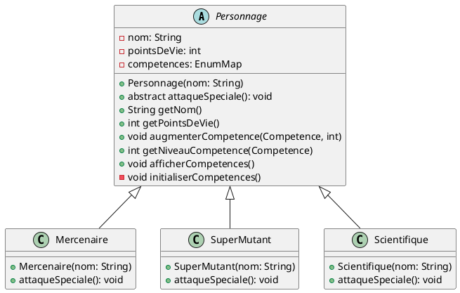

### **Étape 5 : Implémentation de classes de personnages spécialisées**

Dans cette étape, vous allez implémenter des classes de personnages spécialisées. Vous utiliserez l'héritage pour créer ces classes et surchargerez la méthode `attaqueSpeciale()` pour chaque type de personnage.

#### Instructions :

1. Utilisez le diagramme de classes suivant comme guide pour créer les classes de personnages spécialisées :



1. Transformez votre classe `Personnage` en une classe abstraite avec les attributs et les méthodes communs à tous les personnages.
2. Ajouter une méthode `public abstract void attaqueSpeciale();`
3. Créez des classes spécialisées `Mercenaire`, `SuperMutant` et `Scientifique` en héritant de la classe `Personnage`.
4. Surchargez la méthode `attaqueSpeciale()` dans chaque classe spécialisée pour définir le comportement de l'attaque spéciale de chaque type de personnage.
5. Testez vos classes en créant des instances de chaque type de personnage et en appelant la méthode `attaqueSpeciale()`.
6. Dans le constructeur, appelez la méthode `super()` pour appeler le constructeur parent qui est censé initialiser les compétences à 0
Après l'initialisation, dans la classe enfant, ajouter par exemple `augmenterCompetence(Competence.AGILITE, 5);` ainsi chaque classe de personnage à un avantage par rapport aux autres.

### Conseils :

- Pour créer une classe avec héritage, utilisez le mot-clé `extends` suivi du nom de la classe parente.
- Pour surcharger une méthode, déclarez une méthode avec la même signature dans la classe enfant, mais avec une implémentation différente.

```java
// Classe Mercenaire
class Mercenaire extends Personnage {
    // Constructeur
    public Mercenaire(String nom) {
        super(nom);
        augmenterCompetence(Competence.AGILITE, 5);
        // Mettez la compétence de votre choix pour illuster
    }

    // Attaque spéciale du mercenaire
    @Override
    public void attaqueSpeciale() {
        System.out.println(getNom() + " utilise son attaque spéciale : Tir de précision !");
    }
}
```

### **Étape 6 : Utilisation du polymorphisme**

Dans l'étape 6, nous allons montrer comment tirer profit du polymorphisme en utilisant les classes spécialisées `Mercenaire`, `SuperMutant`, et `Scientifique` dans notre programme principal. Voici un exemple de code :

```java
public class Main {
    public static void main(String[] args) {
        // Création d'une liste de personnages
        List<Personnage> personnages = new ArrayList<>();
        
        // Ajout de différents types de personnages à la liste
        personnages.add(new Mercenaire("John"));
        personnages.add(new SuperMutant("Gronk"));
        personnages.add(new Scientifique("Dr. Smith"));
        
        // Boucle sur la liste des personnages pour les faire attaquer
        for (Personnage personnage : personnages) {
            System.out.println("Nom du personnage : " + personnage.getNom());
            personnage.attaqueSpeciale();
            personnage.afficherCompetences();
            System.out.println(); // Saut de ligne pour la lisibilité
        }
    }
}
```

Dans ce code, nous utilisons une liste de type `Personnage` pour stocker différents types de personnages : `Mercenaire`, `SuperMutant`, et `Scientifique`. Lorsque nous parcourons la liste des personnages, nous appelons la méthode `attaqueSpeciale()`.

Grâce au polymorphisme, l'appel à `attaqueSpeciale()` sur chaque objet de la liste déclenchera l'implémentation spécifique de cette méthode dans la classe concrète à laquelle l'objet appartient. Cela nous permet d'appeler la méthode appropriée pour chaque type de personnage sans avoir à connaître le type exact à l'avance, ce qui rend notre code plus flexible et extensible.

### Étape 7 : Ajout d'armes et d'armures au personnage

Dans cette étape, nous allons étendre la classe `Personnage` pour lui permettre de porter des armes et des armures. Nous allons également créer des classes pour les armes et les armures, qui hériteront d'une classe abstraite `Item`.

#### Instructions :

1. Créez une classe abstraite `Item` avec trois attributs : `description` de type String `poids` de type double et `prix` de type double.
2. Ajoutez deux sous-classes **abstraites** de `Item` : `Arme` et `Armure`.
3. La classe `Arme` doit avoir un attribut supplémentaire `degats` de type int, représentant les dégâts infligés par l'arme.
4. La classe `Armure` doit avoir un attribut supplémentaire `protection` de type int, représentant le niveau de protection fourni par l'armure.
5. Modifiez la classe `Personnage` pour lui permettre de porter une arme et/ou une armure. Ajoutez les méthodes `equiperArme()` et `equiperArmure()` pour cela.
6. Testez vos classes en créant des classes dérivées de d'armes et d'armures et quelques instances, et en les équipant à un personnage, et en simulant des interactions de combat.

À la fin de cette étape, votre classe `Personnage` devrait être capable de porter des armes et des armures, ce qui ajoutera une dimension tactique intéressante à votre RPG.


### Étape 8 : Gestion de l'inventaire

Dans cette étape, nous allons nous concentrer sur la gestion de l'inventaire dans notre jeu RPG, en utilisant les classes Collection de Java pour stocker les objets et en introduisant les interfaces et les comparateurs pour enrichir cette fonctionnalité.

#### Partie théorique : Interfaces et comparateurs en Java

Avant de commencer à coder, examinons brièvement deux concepts clés que nous allons utiliser :

- **Interfaces en Java :** Une interface est un contrat que les classes peuvent choisir de remplir en implémentant ses méthodes. Cela permet de définir un ensemble de comportements sans spécifier comment ils doivent être implémentés. Dans notre cas, nous allons créer une interface `IValuable` avec une méthode `aPourValeur` pour représenter la valeur des objets.

- **Comparateurs en Java :** Les comparateurs sont des objets qui définissent un ordre total sur des objets. Ils sont utilisés pour trier des collections d'objets selon certains critères. Nous allons créer des comparateurs pour trier les objets de l'inventaire en fonction de leur prix, leur poids et leur valeur.

Maintenant que nous avons une compréhension de base de ces concepts, passons à la mise en pratique.

#### Ressources supplémentaires :

- [Interface en Java (Oracle Documentation)](https://docs.oracle.com/javase/tutorial/java/concepts/interface.html)
- [Comparateurs en Java (Oracle Documentation)](https://docs.oracle.com/javase/8/docs/api/java/util/Comparator.html)


#### Instructions :

1. **Création de l'interface `IValuable` :**

    Implémentez une interface `IValuable` avec une méthode `aPourValeur` qui renvoie la valeur de l'objet. Cette interface sera utilisée pour définir le comportement des objets ayant une valeur dans notre jeu.
    [!CAUTION] Je ne parle pas de la valeur "prix" mais pour une arme ce sera ses dégats et pour une protection son niveau de protection

2. **Utilisation de l'interface dans la classe `Item` :**

    Dans la méthode `toString` de la classe `Item`, utilisez l'opérateur `instanceof` pour vérifier si l'objet implémente l'interface `IValuable`. Si c'est le cas, affichez la valeur de l'objet.

3. **Méthode `ajouterALInventaire` :**

    Implémentez une méthode `ajouterALInventaire` qui ajoute un objet à l'inventaire. Utilisez une collection de type `Set` pour stocker les objets uniques, en évitant les doublons.

4. **Affichage de l'inventaire :**

    Implémentez une méthode `afficherInventaire` qui utilise les Streams pour grouper les objets de l'inventaire par le nom de leur classe. Présentez l'introspection en expliquant comment cela permet d'accéder aux métadonnées des classes à l'exécution.

5. **Menu de sélection d'affichage :**

    Créez un menu interactif qui permet aux joueurs de choisir quelle page d'inventaire ils veulent voir. Utilisez les méthodes `System.out.println` pour afficher les options et la classe `Scanner` pour lire l'entrée de l'utilisateur.

6. **Implémentation des comparateurs :**

    Créez des comparateurs pour trier les objets en fonction de leur prix, leur poids et leur valeur. Utilisez les interfaces `Comparator` pour définir ces comparateurs.

7. **Tri de l'inventaire :**

    Dans le menu de sélection, permettez aux joueurs de choisir le type de tri qu'ils veulent appliquer à leur inventaire en tapant une lettre suivie d'un numéro correspondant au type de comparateur.
    > Vous pouvez utiliser la méthode `Collections.sort` pour trier les objets en utilisant les comparateurs.
    Vous pouvez également utiliser les Streams pour trier les objets en fonction de leur valeur (dégats ou protection), de leur poids ou de leur prix.
    Pour cela stockez les comparateurs dans des variables et utilisez les ainsi
    ```java
    Collections.sort(inventaire, comparateur);
    ```

En suivant ces étapes, vous allez enrichir votre jeu RPG en permettant aux joueurs de gérer efficacement leur inventaire et de personnaliser leur expérience de jeu en fonction de leurs besoins et préférences.


### Etape 9 : Niveau d'expérience et Points de vie

Avant de passer à la création du système d'exploration, nous allons ajouter deux nouvelles fonctionnalités importantes à notre jeu : un niveau d'expérience pour le personnage et des points de vie.

#### Instructions :

1. **Ajout du niveau d'expérience :**

    Ajoutez un attribut `niveauExperience` à la classe `Personnage` pour suivre le niveau d'expérience du personnage.

2. **Ajout des points de vie :**

    Ajoutez une méthode `getPointsDeVie` à la classe `Personnage` pour représenter les points de vie du personnage.
    Dans un premier temps, le personnage ne perds pas définitivement ses points de vie mais il les récupère à chaque fois qu'il est blessé à l'issue d'un combat.
    En l'occurence, c'est plutôt "points de vie max" que vous allez implémenter.
    Faites que la méthode renvoie `100 + Force * 10`

### Création du système d'exploration

Maintenant que nous avons enrichi notre personnage, nous allons créer un système d'exploration pour lui permettre de vivre des aventures excitantes et dangereuses !

#### Classe ExplorationGenerator

1. **Création de la classe ExplorationGenerator :**

    Créez une nouvelle classe `ExplorationGenerator` qui exposera une méthode `explorer(Personnage)`. Cette méthode permettra au personnage de découvrir de nouveaux endroits et d'interagir avec ce qu'il y trouve.

2. **Méthode `explorer` :**

    Dans la méthode `explorer`, générez un nombre aléatoire. Sur une chance sur 4, appelez la méthode `looterUnObjet()`, sinon appelez la méthode `combat()`. 

3. **Méthode `combat` :**

    La méthode `combat` devra être définie dans l'interface `ICombatGenerator`. Elle prendra en paramètre le personnage et renverra un boolean indiquant le résultat du combat (victoire ou défaite).

4. **Méthode `looterUnObjet` :**

    La méthode `looterUnObjet` devra être définie dans l'interface `ILootGenerator`. Elle prendra également en paramètre le personnage et renverra un objet `Item`.

5. **Gestion de la victoire :**

    Si le résultat du combat est `true`, c'est-à-dire que le personnage a remporté le combat, il y a une chance sur 2 d'appeler la méthode `looterUnObjet`. Dans tous les cas, le personnage gagnera de l'expérience.

6. **Interfaces pour la génération :**

    Stockez une référence vers une instance des interfaces `ILootGenerator`, `ICombatGenerator` et `IExperienceGenerator`. Ces interfaces prennent en paramètre un personnage et renvoient respectivement un objet `Item`, un boolean et un entier.


### Interfaces pour la génération de loot, de combat et d'expérience

Voici les interfaces et les classes concrètes pour générer du loot, gérer les combats et calculer l'expérience gagnée par le personnage.

#### Interface ILootGenerator :

```java
public interface ILootGenerator {
    Item genererLoot();
}
```

#### Interface ICombatGenerator :

```java
public interface ICombatGenerator {
    boolean combat(Personnage personnage);
}
```

#### Interface IExperienceGenerator :

```java
public interface IExperienceGenerator {
    int calculerExperience(Personnage personnage);
}
```

### Implémentations des classes :

#### LootGenerator :

```java
import java.util.Random;

public class LootGenerator implements ILootGenerator {
    private Random random;

    public LootGenerator() {
        this.random = new Random();
    }

    @Override
    public Item genererLoot() {
        int choix = random.nextInt(6); // Génère un nombre aléatoire entre 0 et 5
        // Vous pouvez vous amuser à rendres équipements plus dur à obtenir que d'autres, vous pouvez fonctionner des plages de valeurs exemple si <50 loot pourris, si <60 moyen , si <70 bon loot etc... par contre il ne sera pas possible d'utiliser un switch case

        switch (choix) {
            case 0:
                return new ArmureCuir();
            case 1:
                return new ArmureTissu();
            case 2:
                return new ArmureMetal();
            case 3:
                return new ArmureCombat();
            case 4:
                return new ArmureEnergetique();
            case 5:
                return new ArmureAssault();
            default:
                // En cas de choix invalide, retourne null
                return null;
        }
    }
}
```

#### CombatGenerator :

```java
public class CombatGenerator implements ICombatGenerator {
    private Random random;

    public CombatGenerator() {
        this.random = new Random();
    }

    @Override
    public boolean combat(Personnage personnage) {
        Points de vie du monstre entre 50 et 100
        int pointsDeViePersonnage = personnage.getPointsDeVie();

        int pointsDeVieMonstre = pointsDeViePersonnage * random.nextDouble(0.9,1.2); // Points de vie du monstre entre 90 et 120% de ceux du personnage
    
        do {
            // Calcul des dégâts infligés par le personnage et le monstre
            int degatsPersonnage = personnage.getDegats() + random.nextInt(11); // Dégâts entre 0 et 10 supplémentaires
            int degatsMonstre = degatsPersonnage * random.nextDouble(0.9,1.2); // Dégâts du monstre entre 90 et 120% de ceux du personnage

            // Appliquer les dégâts
            pointsDeVieMonstre -= degatsPersonnage;
            pointsDeViePersonnage -= degatsMonstre;

            // Vérifier si le combat est terminé
            if (pointsDeVieMonstre <= 0) {
                // Le personnage a gagné
            
                return true;
            } else if (pointsDeViePersonnage <= 0) {
                // Le monstre a gagné
               
                return false;
            }
        } while (pointsDeVieMonstre > 0 && pointsDeViePersonnage > 0);

        // Ce cas ne devrait normalement pas être atteint
        return false;
    }
}
```

#### ExperienceGenerator :

```java
public class ExperienceGenerator implements IExperienceGenerator {
    @Override
    public int calculerExperience(Personnage personnage) {
        int intelligence = personnage.getIntelligence();
        int chance = personnage.getChance();
        
        // Calcul de l'expérience en fonction de l'intelligence et de la chance du personnage
        return (intelligence * 10) + (chance * 5);
    }
}
```

7. **Amélioration du générateur de combat**

    1. Vous remarquerez que la protection du personnage et les degats de son arme ne rentrent pas en compte. C'est à vous d'améliorer cette méthode pour qu'elle prenne en compte ces paramètres.
    2. Rappelez vous que votre personnage à une compétence attaque spéciale, vous pouvez l'utiliser pour augmenter les dégats infligés par le personnage.
    3. Vous pouvez également jouer d'avantage avec la compétence Chance du personnage
    4. Ajouter des sorties consoles pour la méthode de combat pour que le joueur puisse suivre le combat.
    6. Implémentez une méthode gainExperience dans la classe Personnage pour ajouter de l'expérience au personnage.
    Cette méthode prendra en paramètre un entier représentant le nombre de points d'expérience à ajouter au personnage.
    Comparez l'ancienne valeur et la nouvelle, si le personnage a gagné un niveau, il pourra augmenter une compétence de son choix.
    [!NOTE] Pour detecter un changement de niveau, soit vous pouvez le faire de manière linéaire (tous les 100 points d'expérience par exemple) soit vous pouvez utiliser une formule mathématique pour calculer le niveau en fonction de l'expérience. Par exemple niveau = experience^0.3 qui donne les paliers suivants :
    >- Niveau 2 : 10
    >- Niveau 3 : 38
    >- Niveau 4 : 101
    >- Niveau 5 : 213
