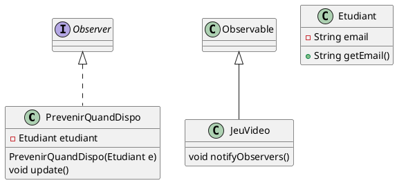
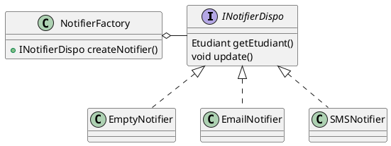

---
export_on_save:
  html: true
---

# Travaux Dirigés 4 - Conception itérative

Dans ce TD, vous allez modéliser un nouveau système comme celui des parcs d'attraction, l'idée et de valider que vous comprenez bien les concepts d'interfaces et d'héritage.
En outre, nous allons introduire des patrons de conception pour vous aider à modéliser votre système.
Nous allons détailler un peu plus nos classes pour répondre à des besoins plus précis.

## Cahier des charges de la solution

- La bibliothèque permet d'emprunter des livres et de les rendre
- La bibliothèque a un catalogue de livres
- Un livre a un titre, un auteur, un éditeur, une date de publication, un nombre de pages, un nombre d'exemplaires disponibles et un nombre d'exemplaires totaux
- Un livre peut être emprunté par un étudiant
- Un étudiant a un nom, un prénom, un numéro d'étudiant, une date de naissance, une adresse, un email, un numéro de téléphone
- La biblitèque se diversifie et propose aussi de louer des jeux vidéos
- Un jeu vidéo a un titre, un éditeur, **une date de sortie, une plateforme,** un nombre d'exemplaires disponibles et un nombre d'exemplaires totaux
- On se rend compte que les jeux vidéos sont très demandés et on aimerait bien pouvoir les réserver
> Pour cela, nous allons introduire un patron de conception : le patron de conception "Observateur" (ou "Observer" en anglais), ce patron de conception permet de notifier des objets lorsqu'un évènement se produit. Dans notre cas, nous allons notifier les étudiants qui ont réservé un jeu vidéo lorsqu'un exemplaire est disponible.
Voici le diagramme de classe à utiliser pour modéliser notre mécanisme de réservation :
Il manque volontairement des éléments dans ce diagramme, à vous de l'adapter pour qu'il corresponde à notre cahier des charges.

- PrevenirQuandDispo est une classe qui implémente l'interface Observer, elle a un attribut Etudiant et un constructeur PrevenirQuandDispo(Etudiant e) et une méthode void update(). Lorqu'un jeu vidéo est disponible, il appelle la méthode notifyObservers() qui appelle la méthode update() de tous les observateurs.
Exemple d'utilisation :
```java
JeuVideo jv = new JeuVideo();
Etudiant e = new Etudiant("a@b.c");
PrevenirQuandDispo p = new PrevenirQuandDispo(e);
jv.addObserver(p);
jv.notifyObservers();

```
- On aimerait utiliser le DP Decorator pour envoyer en plus un SMS à l'étudiant lorsqu'un jeu vidéo est disponible
> Pour cela, nous allons introduire un patron de conception : le patron de conception "Décorateur" (ou "Decorator" en anglais), ce patron de conception permet d'ajouter des fonctionnalités à un objet sans modifier sa structure. Dans notre cas, nous allons ajouter la fonctionnalité d'envoyer un SMS à un étudiant lorsqu'un jeu vidéo est disponible.

Renommez la classe PrevenirQuandDispo en EmailNotifier et créez une interface INotifierDispo et une classe SMSNotifier qui implémente cette interface.
SMSNotifier prends en paramètre un INotifierDispo et surcharge la méthode void update() pour envoyer ainsi un SMS à l'étudiant.
```java
interface INotifierDispo extends Observer{
    Etudiant getEtudiant();
}
class EmptyNotifier implements INotifierDispo{
    void update(){}
    Etudiant getEtudiant(){}
}
class EmailNotifier implements INotifierDispo{
    EmailNotifier(INotifierDispo e)
    void update()
}
class SMSNotifier implements INotifierDispo{
    SMSNotifier(INotifierDispo e)
    void update()
}

public class Main{
    public static void main(String[] args){
        JeuVideo jv = new JeuVideo();
        Etudiant e = new Etudiant("a@b.c");
        Etudiant e2 = new Etudiant("d@e.f");
        INotifierDispo p = new EmailNotifier(new SMSNotifier(new EmptyNotifier()));
        INotifierDispo p2 = new EmailNotifier(new EmptyNotifier());
        jv.addObserver(p2);
        jv.addObserver(p);
        jv.notifyObservers();
    }
}
```
- Vous allez maintenant implémenter le patron de conception "Fabrique" (ou "Factory" en anglais) pour créer INotifierDispo


- Votre bibliothèque a un budget limité et vous aimeriez bien pouvoir suivre les dépenses, vous ne resistez pas à l'appât du gain et vous mettez en place deux strétégies pour augmenter vos revenus :
    - La location d'une oeuvre est a 2€ par semaine
    - Il existe un abonnement à 10€ par mois pour emprunter autant d'oeuvres que l'on veut, mais pas plus de 3 à la fois.

> Indice : Vous pouvez utiliser le patron de conception "Stratégie" (ou "Strategy" en anglais) pour modéliser ces deux stratégies.
Créez une interface ILoaningStrategy avec une méthode `bool canBorrow(ILoanable l)` et une méthode `float getPrice(ILoanable l, int durationInWeeks)`.
Créez deux classe WeeklyLoan et MonthlySubscription qui implémentent cette interface.
Vous créer une classe Abonné qui est un peu comme un étudiant, les abonnés et les étudiants ont un attribut `ILoaningStrategy strategy` et un autre attribut `List<ILoanable> borrowed`.

- Vous aurez compris que les jeux vidéos et les livres sont des objets que l'on peut emprunter, vous avez plusieurs solutions :
    - Créer une interface ILoanable avec une méthode `bool canBeBorrowed()`, `void borrow()` et `void return()`
        - Vous pouvez appliquer cette interface à la classe Livre et à la classe JeuVideo mais vous risquez de vous retrouver avec du code dupliqué
        - Vous pouvez aussi créer une classe abstraite Loanable qui implémente cette interface et qui contient le code commun
        Le problème de cette solution c'est que vos classes Livre et JeuVideo ne pourront pas hériter d'une autre classe, d'ailleurs vous héritez déjà de Observable, enfin vos classes Livre et JeuVideo sont des classes "DTO" (Data Transfer Object) et vous ne voulez pas les alourdir avec des méthodes qui ne les concernent pas.
    - Je vous propose de créer un gestionnaire de prêt, (il s'agit d'un patron de conception, lequel ?, je pense que c'est Mediateur mais je ne suis pas sur) qui contient une méthode `bool canBeBorrowed(ILoanable l, Etudiant e)`, `void borrow(ILoanable l, Etudiant e)` et `void return(ILoanable l, Etudiant e)`.
    C'est ce gestionnaire de prêt qui va manipuler vos classes "Empruntables" et la liste des emprunts des étudiants / abonnés.
    Cette classe doit être unique et doit être accessible par tous les étudiants / abonnés.
    > Vous comprenez que c'est le patron de conception "Singleton" qui est adapté à ce cas de figure.
    Créez une classe LoanManager qui implémente cette interface et qui est un singleton.
