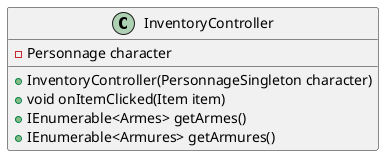
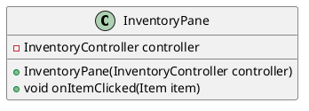

Dans ce TP, nous allons passer à l'interface graphique. Nous allons utiliser Java Swing pour cela.
Je vous conseille d'installer un IDE comme IntelliJ pour cette étape.

> L'objectif n'est pas de vous apprendre à utiliser Java Swing, c'est une technologie qui est en fin de vie, pénible à utiliser ; justement, ce sera l'occasion de vous présenter des concepts poussés afin de vous montrer comment on peut les utiliser pour simplifier la vie du développeur.

Pour gérer l'interface graphique, nous allons utiliser le patron de conception "Modèle-Vue-Contrôleur" (MVC). C'est un patron de conception qui permet de séparer les données de l'interface graphique et de la logique métier. Cela permet de rendre le code plus modulaire et de faciliter les tests unitaires.

Le projet initialisé est disponible [ici](https://github.com/AlexisPicot/TP.ICS)


> Le projet ne comporte pas tout ce que vous avez fait jusqu'à présent. Vous devrez donc ajouter les classes que vous avez créées dans ce projet.

En outre, le projet comporte des notions que vous n'avez pas encore vues. Vous devrez donc vous renseigner sur ces notions pour comprendre le code.

Par exemple, nous utilisons de l'injection de dépendance pour instancier les classes. Vous devrez donc comprendre ce que c'est et comment cela fonctionne.

Dans les grandes lignes, l'injection de dépendance consiste à passer les dépendances d'une classe en paramètre de son constructeur. Cela permet de rendre les classes plus modulaires et de faciliter les tests unitaires.

Nous allons également utiliser des annotations pour déclarer les classes comme des composants Spring. Vous devrez donc comprendre ce que sont les annotations et comment elles fonctionnent.
Enfin, nous allons nous servir de l'interface Observer/Observable pour notifier les observateurs lorsqu'un événement se produit. Vous devrez donc comprendre ce que sont les observateurs et comment ils fonctionnent.

Toutes ces notions sont plus ou moins des "Design Patterns" qui sont des solutions à des problèmes récurrents en programmation.

L'idée, vous allez le voir c'est que si votre application doit afficher une liste de messages dans la fenêtre principale, par exemple pour savoir combien d'expérience vous avez gagné lors de votre précédent combat, ou alors comprendre pourquoi vous avez perdu et améliorer votre stratégie, vous n'allez pas conserver une référence vers la variable "Texte à afficher", nous allons crée un service "MessageService" qui va s'occuper de gérer les messages. Ainsi, si nous voulons changer la manière dont les messages sont affichés, nous n'aurons pas à modifier toutes les classes qui affichent des messages, mais seulement le service "MessageService".
Grâce à l'injection de dépendance, partout ou vous voudrez afficher un message, vous pourrez simplement ajouter un paramètre "MessageService" à votre constructeur et le tour est joué.

```java
@Component
public class MessageService extends Observable {
    private ArrayList<String> messages = new ArrayList<>();

    // Ajouter un message à la liste et notifier les observateurs
    public void addMessage(String message) {
        messages.add(message);
        setChanged();
        notifyObservers(message);
    }

    // Obtenir la liste des messages
    public ArrayList<String> getMessages() {
        return messages;
    }
}
```

Ici, nous avons crée un service "MessageService" qui va s'occuper de gérer les messages. Nous avons également utilisé l'interface "Observable" pour notifier les observateurs lorsqu'un message est ajouté à la liste.

```java
  public RandomMessageGenerator(MessageService messageService) {
        this.messageService = messageService;
        messageService.addMessage("Salut");
  }
```

Ici, nous avons utilisé l'injection de dépendance pour passer le service "MessageService" en paramètre du constructeur.
Notez que nous avons également ajouté un message à la liste.


```java
@Component
public class Events extends JTextPane {
    private final MessageService messageService;

    public Events(MessageService messageService) {
        this.messageService = messageService;
        setEditable(false); // Empêcher l'édition du texte
        setPreferredSize(new Dimension(300, 0)); // Taille par défaut
        setBorder(BorderFactory.createLineBorder(Color.BLACK)); // Bordure

        messageService.addObserver((o, arg) -> {
            if (arg instanceof String) {
                String message = (String) arg;
                this.setText(this.getText() + message + "\n");
            }
        });
    }
}
```

Dans notre classe "Events", qui est une classe "graphique" nous avons utilisé l'injection de dépendance pour passer le service "MessageService" en paramètre du constructeur.
Comme nous avons utilisé l'interface "Observable" dans le service "MessageService", nous pouvons ajouter un observateur à ce service pour être notifié lorsqu'un message est ajouté à la liste.

A aucun moment nous n'avons utilisé "new" pour instancier une classe. Nous avons toujours passé les dépendances en paramètre du constructeur. Si demain mon service "MessageService" a besoin d'une autre dépendance, je n'aurais qu'à ajouter cette dépendance en paramètre du constructeur, les autres classes qui utilisent ce service n'auront pas à être modifiées.

### Etape 10 : Rappatrier votre code dans le projet

Pour cette étape, vous pouvez soit créer un projet vous même si vous vous sentez à l'aise, soit cloner le projet, et copier/coller vos classes dans le projet.

Actuellement, l'application permet les choses suivantes :
- Afficher une carte du monde générée de manière procédurale
    - Afficher un personnage sur la carte
    - Vous pouvez vous déplacer sur la carte, par contre vous ne pouvez pas encore interagir avec les éléments de la carte
    - Votre personnage peut aussi aller dans l'eau, ce qui n'est pas très réaliste
- Il y a une interface très moche qui permet de répartir ses points S.P.E.C.I.A.L. (Force, Perception, Endurance, Charisme, Intelligence, Agilité, Chance)


### Etape 11 : Crée un nouvel écran pour afficher l'inventaire

En observant le code, vous avez remarqué que si une classe possède l'annotation
```java
@IGameMainMenu("Exploration")
public class ExplorationPane extends JPanel implements IOnShown {
```
Elle sera ajoutée à l'interface graphique. Vous pouvez donc créer une nouvelle classe qui hérite de JPanel et qui possède cette annotation pour ajouter un nouvel écran à l'interface graphique.

L'interface `IOnShown` est une interface qui permet de notifier une classe lorsqu'elle est affichée. Vous pouvez donc implémenter cette interface pour effectuer des actions lorsqu'un écran est affiché. Vous n'êtes pas obligé de l'implémenter si vous n'en avez pas besoin.

> Comment le programme fait-il pour comprendre que c'est un nouvel écran ? Il utilise la réflexion. La réflexion est une fonctionnalité de Java qui permet de manipuler les classes à l'exécution. Vous pouvez par exemple obtenir la liste des classes qui possèdent une annotation, ou bien obtenir la liste des méthodes d'une classe. C'est grâce à la réflexion que le programme peut ajouter les écrans à l'interface graphique.
```java
Map<String, Object> beansWithAnnotation = context.getBeansWithAnnotation(IGameMainMenu.class);
        beansWithAnnotation.forEach((s, o) -> {

            jTabbedPane.add(s, (java.awt.Component) o);

        });
        jTabbedPane.addChangeListener(new ChangeListener() {
            @Override
            public void stateChanged(ChangeEvent e) {

                if (jTabbedPane.getSelectedComponent() instanceof IOnShown) {
                    ((IOnShown) jTabbedPane.getSelectedComponent()).onShown();
                }
            }
        });
```

Dans votre nouvel écran, vous pouvez afficher l'inventaire du personnage. Choisissez une manière de représenter l'inventaire, par exemple une liste d'objets, ou bien une grille d'objets.
Une fois l'objet choisi, vous pourriez, à la manière de l'écran de répartition des points S.P.E.C.I.A.L., accéder à votre personnage pour lui ajouter des objets.
Toutefois, comme nous voulons faire du MVC, vous devriez créer un contrôleur pour gérer la sélection des objets.

Pour cela créez une nouvelle classe `InventoryController` qui va gérer la sélection des objets.
Votre classe peut ressembler à ceci :


Et votre écran pourrait ressembler à ceci :


Notez, que le contrôleur est passé en paramètre du constructeur. Ce, grâce à l'injection de dépendance, vous pourrez donc facilement changer le contrôleur si vous en avez besoin.


### Etape 12 : Affichage dans la console du choix d'un objet

Finalement, nous aimerions que lorsqu'un objet est sélectionné, le nom de l'objet soit affiché dans la console.
Pour cela, dans votre contrôleur, vous pouvez ajouter au constructeur un paramètre de type `MessageService`. Stockez le dans un attribut de votre classe.

Dans votre méthode `onItemClicked`, vous pouvez appeler la méthode `addMessage` de votre service pour ajouter le nom de l'objet à la liste des messages.

**Vous devriez être convaincu que cette manière de faire est plus modulaire et plus facile à maintenir.**
Si nous n'avions pas utilisé l'injection de dépendance, nous aurions dû modifier la classe principale pour qu'elle passe en paramètre le `MessageService` à l'écran pour que celui ci le passe au contrôleur. Ici, nous n'avons eu qu'à ajouter un paramètre au constructeur du contrôleur.


### Etape 13 : Application du patron de conception "Stratégie"

Dernièrement, vous avez crée des classes ExperienceGenerator, LootGenerator qui implémentaient les interfaces IExperienceGenerator et ILootGenerator. Ces classes étaient utilisées dans la classe `Combat` pour générer de l'expérience et des objets lorsqu'un combat était gagné.

Vous savez maintenant comment ajouter des messages dans la console, vous pouvez donc en profiter pour ajouter un peu de lore à votre jeu.

Dupliquez votre ExperienceGenerator et appelez le ExperienceGeneratorII. Modifiez le rapidement pour que l'expérience générée soit différente.

Documentez vous afin d'utiliser SpringBoot et le DP Stratégie, par exemple à l'aide de [Ce lien](https://thegeekyasian.com/strategy-pattern-spring-boot/) mais ce ne sera peut-ête pas suffisant.

On souhaite ajouter un menu à notre application pour choisir le générateur d'expérience à utiliser. Pour cela, vous pouvez créer une nouvelle classe qui hérite de JPanel et qui possède l'annotation `@IGameMainMenu("Configuration")`. Vous pouvez ajouter un menu déroulant pour choisir le générateur d'expérience à utiliser.
Ce sera en quelque sorte une jauge de difficulté pour votre jeu.

### Etape 14 : Place à l'exploration

Actuellement votre carte permet de se déplacer, mais vous ne pouvez pas interagir avec les éléments de la carte.
En plus, le déplacement n'utilise pas de contrôleur, ce qui n'est pas très modulaire.


Nous allons d'abord améliorer notre affichage de carte, actuellement, il se base sur des caractères pour savoir quoi afficher
Le générateur renvoie des lettres mais il n'est pas normal de devoir les manipuler pour savoir quoi afficher.

Créez une enum `WorldMapTile` : 
```java	
public enum WorldMapTile {
    LAND('G'),
    WATER('A'),
    HILL('M'),
    DESERT('J'),
    BEACH('D'),
    MOUNTAIN('P');

    private final char symbol;

    WorldMapTile(char symbol) {
        this.symbol = symbol;
    }

    public static WorldMapTile fromChar(char c) {
        for (WorldMapTile tile : values()) {
            if (tile.symbol == c) {
                return tile;
            }
        }
        throw new IllegalArgumentException("Unknown tile symbol: " + c);
    }

    public char getSymbol() {
        return symbol;
    }
}

```


Créez également une classe `CoordStruct` :
```java
public class CoordStruct {
    @Override
    public boolean equals(Object o) {
        if (this == o) return true;
        if (o == null || getClass() != o.getClass()) return false;
        CoordStruct that = (CoordStruct) o;
        return x == that.x && y == that.y;
    }

    @Override
    public int hashCode() {
        return Objects.hash(x, y);
    }

    public final int x;
    public final int y;
    public CoordStruct(int x, int y) {
        this.x = x;
        this.y = y;
    }
}

```

Enfin, ajouter ce fichier à votre projet 
```java
package tp.services.mapProvider.poi;

import com.google.common.base.Supplier;
import org.springframework.beans.factory.annotation.Autowired;
import org.springframework.beans.factory.annotation.Qualifier;
import org.springframework.context.ApplicationContext;
import org.springframework.context.annotation.Primary;
import org.springframework.context.annotation.Scope;
import org.springframework.stereotype.Component;
import tp.CoordStruct;
import tp.PersonnageSingleton;
import tp.model.Item;
import tp.services.CombatGenerator;
import tp.services.ExperienceGenerator;
import tp.services.LootGenerator;
import tp.services.mapProvider.IWorldMapProvider;
import tp.services.mapProvider.WorldMapTile;
import tp.util.MessageService;

import java.awt.*;
import java.util.ArrayList;
import java.util.Optional;
import java.util.Random;
import java.util.stream.Collectors;


public abstract class POI {
    private final CoordStruct position;

    public POI(CoordStruct position) {
        this.position = position;
    }

    public CoordStruct getPosition() {
        return position;
    }
    @Autowired
    protected LootGenerator lootGenerator;
    @Autowired
    protected PersonnageSingleton personnageSingleton;
    @Autowired
    protected MessageService messageService;
    @Autowired
    protected CombatGenerator combatGenerator;
    @Autowired
    protected ExperienceGenerator experienceGenerator;
    public void interact() {

    }

    @Component
    @Scope("prototype")
    public static class MonsterPOI extends POI {
        @Override
        public void interact() {
            super.interact();
            messageService.addMessage("Vous avez rencontré un monstre", Color.red);
            combatGenerator.combat(this);
        }


        public MonsterPOI(CoordStruct position) {
            super(position);
        }

    }

    @Component

    @Scope("prototype")
    public static class DungeonPOI extends POI {
        public DungeonPOI(CoordStruct coordStruct) {
            super(coordStruct);
        }

        @Override
        public void interact() {
            super.interact();
            messageService.addMessage("Vous avez rencontré un donjon", Color.red);

            for (var i : new Random().ints(10).boxed().collect(Collectors.toList())) {
                if(i%2==0){
                    Item newItem = lootGenerator.genererLoot();
                    personnageSingleton.getInstance().ajouterALInventaire(newItem);
                    messageService.addMessage("Nouveau loot -> " + newItem.getNom(), Color.blue);
                }else {
                    messageService.addMessage("Vous avez rencontré un monstre", Color.red);
                    if (!combatGenerator.combat()) {
                        break;
                    }
                }
            }
        }
    }


    @Component

    @Scope("prototype")
    public static class TreasurePOI extends POI {
        @Override
        public void interact() {
            super.interact();
            messageService.addMessage("Vous avez trouvé un trésor", Color.green);
            Item newItem = lootGenerator.genererLoot();
            personnageSingleton.getInstance().ajouterALInventaire(newItem);
            messageService.addMessage("Nouveau loot -> " + newItem.getNom(), Color.blue);

        }

        public TreasurePOI(CoordStruct coordStruct) {
            super(coordStruct);
        }
    }

    public enum POITypes {

        Monster(0, MonsterPOI.class),
        Treasure(1, TreasurePOI.class),
        Dungeon(2, DungeonPOI.class),
        ;

        public final Class<? extends POI> poiType;

        POITypes(int i, Class<? extends POI> poiType) {
            this.poiType = poiType;
        }
    }

    @Component
    public static class PoiSupplier extends RandomEnumGenerator<POITypes> implements Supplier<POITypes> {

        public PoiSupplier() {
            super(POITypes.class);
        }

        @Override
        public POITypes get() {
            return this.nextEnum();
        }
    }

    public static class PseudoNormalNumberGenerator {
        private final Random random;
        private final double maxDeviation;

        public PseudoNormalNumberGenerator(int maxDeviation) {
            this.random = new Random();
            this.maxDeviation = maxDeviation;
        }

        protected int nextGaussianInRange() {
            double u1 = 1.0 - random.nextDouble();
            double u2 = 1.0 - random.nextDouble();
            double randStdNormal = Math.sqrt(-2.0 * Math.log(u1)) * Math.sin(2.0 * Math.PI * u2);
            return (int) ((Math.abs(randStdNormal)*maxDeviation)%maxDeviation);
        }

        public static void main(String[] args) {
            PseudoNormalNumberGenerator generator = new PseudoNormalNumberGenerator(5); // Example with maximum deviation of 10
            for (int i = 0; i < 15; i++) {
                System.out.println(generator.nextGaussianInRange());
            }
        }
    }

    public abstract static class RandomEnumGenerator<T extends Enum<T>>  extends PseudoNormalNumberGenerator {
        private final Class<T> enumClass;

        public T nextEnum() {
            return enumClass.getEnumConstants()[this.nextGaussianInRange()];
        }
        public RandomEnumGenerator(Class<T> enumClass) {
            super(enumClass.getEnumConstants().length);
            this.enumClass = enumClass;
        }
    }

    @Component
    public static class MapPOIGenerator {

        private final ArrayList<POI> poies;

        public ArrayList<POI> getPoies() {
            return poies;
        }

        public MapPOIGenerator(IWorldMapProvider mapProvider, Supplier<POITypes> randomPoiGenerator, PoiFactory poiFactroy){

            poies = new ArrayList<>();
            for (int i = mapProvider.getMapMatrix().length - 1; i >= 1; i--) {
                for (int j = 1; j < mapProvider.getMapMatrix()[i].length; j++) {
                    if (mapProvider.getMapMatrix()[i][j] == WorldMapTile.WATER) {
                        continue;
                    }
                    if (new Random().nextDouble()>0.2f) {
                        continue;
                    }

                   poies.add(poiFactroy.createPoi(randomPoiGenerator.get().poiType, new CoordStruct(i, j)));
                }
            }

        }

        public Optional<POI> popPoi(CoordStruct position) {
            Optional<POI> optionalPOI = getPoies().stream().filter(e -> e.getPosition().equals(position)).findAny();
            optionalPOI.ifPresent(poi -> getPoies().remove(poi));
            return optionalPOI;
        }
    }

    @Component
    public static class PoiFactory{
        private final ApplicationContext context;
    public <T extends POI> T createPoi(Class<T> poiType, CoordStruct position) {

            return context.getBean( poiType, position);

        }
        public PoiFactory(ApplicationContext context) {

            this.context = context;
        }

    }
}

```

Ce code permet de créer des points d'intérêt sur la carte. Vous pouvez créer des monstres, des trésors, des donjons, etc. Ces points d'intérêt définissent une position sur la carte et une méthode `interact` qui est appelée lorsque le personnage interagit avec le point d'intérêt.

Il nous faut maintenant modifier notre contrôleur pour qu'il gère l'interaction avec les points d'intérêt.
Aussi, il faudra modifier notre écran pour qu'il affiche les points d'intérêt sur la carte.

Votre contrôleur pourrait ressembler à ceci :
``` java
    public WorldMapTile[][] getMap() {
        return mapProviderMap.getMapMatrix();
    }

    public Collection<POI> getPOI() {
        return mapPOIGenerator.getPoies();
    }
    public CoordStruct getPersonnagePosition() {
        return personnageSingleton.getInstance().getPosition();
    }
    public void move(Direction direction) {
        CoordStruct position = personnageSingleton.getInstance().getPosition();

        int x = position.x;
        int y = position.y;
        if (direction == Direction.NORD) {
            y--;
        } else if (direction == Direction.SUD) {
            y++;
        } else if (direction == Direction.EST) {
            x++;
        } else if (direction == Direction.OUEST) {
            x--;
        }

        if (mapProviderMap.getMapMatrix()[x][y] == WorldMapTile.WATER)
            messageService.addMessage("Votre personnage ne peut pas se déplacer sur l'eau.");
        else {
            if (direction == Direction.NORD) {
                personnageSingleton.getInstance().move(0, -1);
            } else if (direction == Direction.SUD) {
                personnageSingleton.getInstance().move(0, 1);
            } else if (direction == Direction.EST) {
                personnageSingleton.getInstance().move(1, 0);
            } else if (direction == Direction.OUEST) {
                personnageSingleton.getInstance().move(-1, 0);
            }

            messageService.addMessage("");
            messageService.addMessage("Le personnage se déplace vers le " + direction);
            explorationGenerator.explorer(personnageSingleton.getInstance());
        }
    }

```

Et votre écran pourrait ressembler à ceci :
```java
package tp.view.component.map;

import org.springframework.stereotype.Component;
import tp.CoordStruct;
import tp.Direction;
import tp.MapController;
import tp.services.mapProvider.WorldMapTile;
import tp.services.mapProvider.poi.*;

import javax.swing.*;
import java.awt.*;
import java.awt.event.KeyEvent;
import java.awt.event.KeyListener;

@Component
public class PixelMap extends JPanel implements KeyListener {
    private final MapController mapController;


    public PixelMap(MapController mapController) {
        this.mapController = mapController;
        addKeyListener(this);
        this.setSize(500, 500);
        this.setPreferredSize(new Dimension(500, 500));
    }

    @Override
    protected void paintComponent(Graphics g) {
        super.paintComponent(g);
        Graphics2D g1 = (Graphics2D) g;
        WorldMapTile[][] map = mapController.getMap();
        // Draw the map
        int cellSize = 10; // Adjust cell size as needed
        int x = 0;
        int y = 0;
        for (int i = 0; i < map.length; i++) {
            for (int j = 0; j < map[i].length; j++) {
                g1.setColor(getColorIndex(map[i][j]));
                g1.fillRect(i * 10, j * 10, 10, 10);
            }
        }


        // Draw player character

        for (var poi : mapController.getPOI()) {
            if (poi.getClass().equals(POI.MonsterPOI.class)) {
                g1.setColor(Color.ORANGE);
            } else if (poi.getClass().equals(POI.TreasurePOI.class)) {
                g1.setColor(Color.GREEN);
            } else if (poi.getClass().equals(POI.DungeonPOI.class)) {
                g1.setColor(Color.MAGENTA);
            }
            g1.fillRect(poi.getPosition().x * cellSize, poi.getPosition().y * cellSize, cellSize, cellSize);
        }

        g1.setColor(Color.YELLOW); // Change color to represent player character
        CoordStruct personnagePosition = this.mapController.getPersonnagePosition();
        g1.fillRect(personnagePosition.x * cellSize, personnagePosition.y * cellSize, cellSize, cellSize);
    }

    private Color getColorIndex(WorldMapTile worldMapTile) {
        switch (worldMapTile) {
            case WATER: return new Color(60,150,170);
            case BEACH: return new Color(215,235,235);
            case LAND: return new Color(70,175,100);
            case DESERT: return new Color(225,215,145);
            case HILL: return new Color(125,105,90);
            case MOUNTAIN: return new Color(86,71,61);
            default: return Color.white;
        }
    }

    @Override
    public void keyTyped(KeyEvent e) {

    }

    @Override
    public void keyPressed(KeyEvent e) {

        // Call PersonnageController to move the player character

        int keyCode = e.getKeyCode();
        switch (keyCode) {
            case KeyEvent.VK_UP:
                mapController.move(Direction.NORD);
                break;
            case KeyEvent.VK_DOWN:
                mapController.move(Direction.SUD);
                break;
            case KeyEvent.VK_LEFT:
                mapController.move(Direction.OUEST);
                break;
            case KeyEvent.VK_RIGHT:
                mapController.move(Direction.EST);
                break;
        }
        repaint(); // Redraw the panel after the player's position changes
    }

    @Override
    public void keyReleased(KeyEvent e) {

    }
}

```


Votre jeu ressemble maintenant à ceci :


